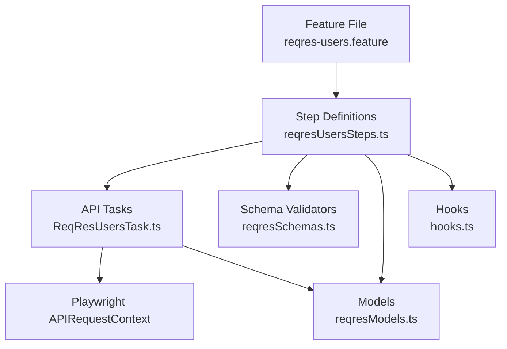

# Documento de Diseño — Automatización Backend: Pruebas API ReqRes.in

## Resumen

Este documento describe el diseño técnico para la automatización de pruebas Backend contra la API pública ReqRes.in (`https://reqres.in/api`). La solución se integra al framework existente de Playwright + Cucumber BDD con TypeScript, utilizando `APIRequestContext` de Playwright para peticiones HTTP directas (sin navegador) y Joi para validación de esquemas de respuesta.

La automatización cubre:
1. Creación de usuario (POST `/api/users`)
2. Consulta de lista de usuarios (GET `/api/users?page=2`)
3. Consulta de usuario individual (GET `/api/users/{id}`)
4. Actualización de usuario (PUT `/api/users/{id}`)
5. Eliminación de usuario (DELETE `/api/users/{id}`)

## Arquitectura

La solución sigue la arquitectura de capas existente en el proyecto, adaptada para pruebas de API (sin Page Objects):



### Capas de la Arquitectura

| Capa | Responsabilidad | Archivos |
|------|----------------|----------|
| **Feature** | Escenarios BDD en español (Gherkin) | `src/test/features/API/reqres-users.feature` |
| **Steps** | Conectan Gherkin con Tasks, assertions y validación de esquemas | `src/test/steps/api/reqresUsersSteps.ts` |
| **Tasks** | Encapsulan peticiones HTTP hacia la API | `src/tasks/api/ReqResUsersTask.ts` |
| **Models** | Interfaces TypeScript para request/response | `src/models/reqresModels.ts` |
| **Schemas** | Esquemas Joi para validación de estructura | `src/models/reqresSchemas.ts` |
| **Hooks** | Ciclo de vida del escenario (APIRequestContext) | `src/hooks/hooks.ts` (existente, sin cambios) |

### Decisiones de Diseño

1. **APIRequestContext gestionado en Steps**: A diferencia de las pruebas UI que usan el `BrowserManager` y hooks para gestionar el browser, las pruebas API crean y destruyen el `APIRequestContext` directamente en los Step Definitions usando hooks `Before`/`After` de Cucumber con tag filter `@layer:Backend`. Esto evita modificar los hooks globales existentes.

2. **Tasks como métodos estáticos**: Siguiendo el patrón establecido en el proyecto (referencia: `GoogleSearchTask`), la API Task expone métodos estáticos que reciben `APIRequestContext` como parámetro. No se usa `PageFixture` porque las pruebas API no requieren browser.

3. **Modelos separados de Schemas**: Las interfaces TypeScript (modelos) se definen en un archivo separado de los esquemas Joi. Los modelos proveen tipado estático en tiempo de compilación; los esquemas Joi proveen validación dinámica en tiempo de ejecución.

4. **Feature file en español**: Usando `# language: es` y tags `@layer:Backend` + `@TEST_TC-xxx` para integración con el sistema de hooks existente y reportes.

5. **Variables de contexto en Steps**: Los Step Definitions almacenan respuestas y datos intermedios (como el ID del usuario creado) en variables de módulo para compartir estado entre pasos dentro del mismo escenario.

6. **Logger reutilizado**: Se usa `createLogger` del proyecto existente para registrar las peticiones y respuestas en los Tasks.

## Componentes e Interfaces

### Componente 1: Modelos de Datos (Nuevo)

**Archivo**: `src/models/reqresModels.ts`

**Responsabilidad**: Definir interfaces TypeScript para las peticiones y respuestas de la API ReqRes.in.

```typescript
// ---- Request Models ----

export interface CreateUserRequest {
  name: string;
  job: string;
}

export interface UpdateUserRequest {
  name: string;
  job: string;
}

// ---- Response Models ----

export interface UserData {
  id: number;
  email: string;
  first_name: string;
  last_name: string;
  avatar: string;
}

export interface SupportData {
  url: string;
  text: string;
}

export interface CreateUserResponse {
  name: string;
  job: string;
  id: string;
  createdAt: string;
}

export interface UpdateUserResponse {
  name: string;
  job: string;
  updatedAt: string;
}

export interface SingleUserResponse {
  data: UserData;
  support: SupportData;
}

export interface ListUsersResponse {
  page: number;
  per_page: number;
  total: number;
  total_pages: number;
  data: UserData[];
  support: SupportData;
}
```

### Componente 2: Esquemas Joi de Validación (Nuevo)

**Archivo**: `src/models/reqresSchemas.ts`

**Responsabilidad**: Definir esquemas Joi para validar la estructura de las respuestas HTTP en tiempo de ejecución.

```typescript
import Joi from 'joi';

// Schema para un objeto usuario dentro de data
const userDataSchema = Joi.object({
  id: Joi.number().integer().required(),
  email: Joi.string().email().required(),
  first_name: Joi.string().required(),
  last_name: Joi.string().required(),
  avatar: Joi.string().uri().required()
});

// Schema para el objeto support
const supportSchema = Joi.object({
  url: Joi.string().uri().required(),
  text: Joi.string().required()
});

// Schema para POST /api/users response
export const createUserResponseSchema = Joi.object({
  name: Joi.string().required(),
  job: Joi.string().required(),
  id: Joi.string().required(),
  createdAt: Joi.string().isoDate().required()
});

// Schema para GET /api/users/{id} response
export const singleUserResponseSchema = Joi.object({
  data: userDataSchema.required(),
  support: supportSchema.required()
});

// Schema para GET /api/users?page=N response
export const listUsersResponseSchema = Joi.object({
  page: Joi.number().integer().required(),
  per_page: Joi.number().integer().required(),
  total: Joi.number().integer().required(),
  total_pages: Joi.number().integer().required(),
  data: Joi.array().items(userDataSchema).min(1).required(),
  support: supportSchema.required()
});

// Schema para PUT /api/users/{id} response
export const updateUserResponseSchema = Joi.object({
  name: Joi.string().required(),
  job: Joi.string().required(),
  updatedAt: Joi.string().isoDate().required()
});
```

### Componente 3: API Task — ReqResUsersTask (Nuevo)

**Archivo**: `src/tasks/api/ReqResUsersTask.ts`

**Responsabilidad**: Encapsular todas las peticiones HTTP hacia la API ReqRes.in.

```typescript
import { APIRequestContext, APIResponse } from '@playwright/test';
import { Logger } from 'winston';
import { CreateUserRequest, UpdateUserRequest } from '../../models/reqresModels';

export class ReqResUsersTask {

  /**
   * POST /api/users — Crear un usuario
   */
  static async createUser(
    request: APIRequestContext,
    data: CreateUserRequest,
    logger: Logger
  ): Promise<APIResponse>;

  /**
   * GET /api/users?page={page} — Listar usuarios
   */
  static async listUsers(
    request: APIRequestContext,
    page: number,
    logger: Logger
  ): Promise<APIResponse>;

  /**
   * GET /api/users/{id} — Obtener un usuario individual
   */
  static async getUser(
    request: APIRequestContext,
    userId: number,
    logger: Logger
  ): Promise<APIResponse>;

  /**
   * PUT /api/users/{id} — Actualizar un usuario
   */
  static async updateUser(
    request: APIRequestContext,
    userId: number,
    data: UpdateUserRequest,
    logger: Logger
  ): Promise<APIResponse>;

  /**
   * DELETE /api/users/{id} — Eliminar un usuario
   */
  static async deleteUser(
    request: APIRequestContext,
    userId: number,
    logger: Logger
  ): Promise<APIResponse>;
}
```

**Implementación de cada método**:
- Ejecutar la petición HTTP usando `request.post()`, `request.get()`, `request.put()` o `request.delete()`
- Registrar en el logger: método HTTP, URL completa y código de estado de la respuesta
- Retornar el `APIResponse` completo para que los Steps realicen las validaciones

### Componente 4: Step Definitions API (Nuevo)

**Archivo**: `src/test/steps/api/reqresUsersSteps.ts`

**Responsabilidad**: Conectar los escenarios Gherkin Backend con las API Tasks y realizar validaciones.

**Estado compartido entre pasos** (variables de módulo):

```typescript
import { Before, After, Given, When, Then, setDefaultTimeout } from '@cucumber/cucumber';
import { expect, request, APIRequestContext, APIResponse } from '@playwright/test';
import { Logger } from 'winston';
import { createLogger } from '../../../helper/util/logger';
import { ReqResUsersTask } from '../../../tasks/api/ReqResUsersTask';
import { CreateUserRequest, UpdateUserRequest } from '../../../models/reqresModels';
import {
  createUserResponseSchema,
  singleUserResponseSchema,
  listUsersResponseSchema,
  updateUserResponseSchema
} from '../../../models/reqresSchemas';

setDefaultTimeout(30000);

// Estado compartido entre pasos del escenario
let apiContext: APIRequestContext;
let logger: Logger;
let lastResponse: APIResponse;
let lastResponseBody: any;
let createdUserId: string;
```

**Hooks locales para API**:

```typescript
Before({ tags: '@layer:Backend' }, async function() {
  logger = createLogger('API-ReqRes', 'backend');
  apiContext = await request.newContext({
    baseURL: 'https://reqres.in',
    extraHTTPHeaders: {
      'Content-Type': 'application/json'
    }
  });
  logger.info('APIRequestContext creado para ReqRes.in');
});

After({ tags: '@layer:Backend' }, async function() {
  if (apiContext) {
    await apiContext.dispose();
    logger.info('APIRequestContext cerrado');
  }
});
```

**Pasos Given**:

```typescript
Given('que la API de ReqRes está disponible', async function() {
  // El APIRequestContext ya fue creado en el Before hook
  logger.info('API de ReqRes disponible y lista para pruebas');
});
```

**Pasos When**:

```typescript
When('el usuario envía una petición POST para crear un usuario con nombre {string} y trabajo {string}',
  async function(name: string, job: string) {
    const requestData: CreateUserRequest = { name, job };
    lastResponse = await ReqResUsersTask.createUser(apiContext, requestData, logger);
    lastResponseBody = await lastResponse.json();
  }
);

When('el usuario envía una petición GET para listar usuarios de la página {int}',
  async function(page: number) {
    lastResponse = await ReqResUsersTask.listUsers(apiContext, page, logger);
    lastResponseBody = await lastResponse.json();
  }
);

When('el usuario envía una petición GET para obtener el usuario con ID {int}',
  async function(userId: number) {
    lastResponse = await ReqResUsersTask.getUser(apiContext, userId, logger);
    lastResponseBody = await lastResponse.json();
  }
);

When('el usuario envía una petición PUT para actualizar el usuario con ID {int} con nombre {string} y trabajo {string}',
  async function(userId: number, name: string, job: string) {
    const requestData: UpdateUserRequest = { name, job };
    lastResponse = await ReqResUsersTask.updateUser(apiContext, userId, requestData, logger);
    lastResponseBody = await lastResponse.json();
  }
);

When('el usuario envía una petición DELETE para eliminar el usuario con ID {int}',
  async function(userId: number) {
    lastResponse = await ReqResUsersTask.deleteUser(apiContext, userId, logger);
    lastResponseBody = null; // DELETE retorna cuerpo vacío
  }
);
```

**Pasos Then**:

```typescript
Then('el código de estado de la respuesta debe ser {int}',
  async function(expectedStatus: number) {
    expect(lastResponse.status()).toBe(expectedStatus);
    logger.info(`Código de estado verificado: ${lastResponse.status()}`);
  }
);

Then('la respuesta de creación debe tener la estructura correcta',
  async function() {
    const { error } = createUserResponseSchema.validate(lastResponseBody);
    expect(error).toBeUndefined();
    logger.info('Estructura de respuesta de creación validada con Joi');
  }
);

Then('la respuesta debe contener el nombre {string} y trabajo {string}',
  async function(name: string, job: string) {
    expect(lastResponseBody.name).toBe(name);
    expect(lastResponseBody.job).toBe(job);
    logger.info(`Datos verificados: name=${name}, job=${job}`);
  }
);

Then('la respuesta de lista de usuarios debe tener la estructura correcta',
  async function() {
    const { error } = listUsersResponseSchema.validate(lastResponseBody);
    expect(error).toBeUndefined();
    logger.info('Estructura de respuesta de lista validada con Joi');
  }
);

Then('la lista de usuarios debe contener al menos un usuario',
  async function() {
    expect(lastResponseBody.data.length).toBeGreaterThan(0);
    logger.info(`Lista contiene ${lastResponseBody.data.length} usuarios`);
  }
);

Then('la respuesta de usuario individual debe tener la estructura correcta',
  async function() {
    const { error } = singleUserResponseSchema.validate(lastResponseBody);
    expect(error).toBeUndefined();
    logger.info('Estructura de respuesta de usuario individual validada con Joi');
  }
);

Then('el usuario retornado debe tener ID {int}',
  async function(expectedId: number) {
    expect(lastResponseBody.data.id).toBe(expectedId);
    logger.info(`ID de usuario verificado: ${expectedId}`);
  }
);

Then('la respuesta de actualización debe tener la estructura correcta',
  async function() {
    const { error } = updateUserResponseSchema.validate(lastResponseBody);
    expect(error).toBeUndefined();
    logger.info('Estructura de respuesta de actualización validada con Joi');
  }
);

Then('el cuerpo de la respuesta debe estar vacío',
  async function() {
    const text = await lastResponse.text();
    expect(text).toBe('');
    logger.info('Cuerpo de respuesta vacío verificado');
  }
);

// Paso para almacenar el ID del usuario creado (usado en E2E)
Then('se almacena el ID del usuario creado',
  async function() {
    createdUserId = lastResponseBody.id;
    expect(createdUserId).toBeDefined();
    logger.info(`ID de usuario creado almacenado: ${createdUserId}`);
  }
);
```

### Componente 5: Feature File API (Nuevo)

**Archivo**: `src/test/features/API/reqres-users.feature`

**Estructura completa**:

```gherkin
# language: es
@layer:Backend
Característica: Pruebas API ReqRes - Gestión de Usuarios
  Como QA Engineer
  Quiero verificar los endpoints de la API ReqRes.in
  Para asegurar que las operaciones CRUD de usuarios funcionan correctamente

  Antecedentes:
    Dado que la API de ReqRes está disponible

  @TEST_TC-301
  @smoke @e2e
  Escenario: Flujo CRUD completo de usuario
    Cuando el usuario envía una petición POST para crear un usuario con nombre "Carlos" y trabajo "QA Engineer"
    Entonces el código de estado de la respuesta debe ser 201
    Y la respuesta debe contener el nombre "Carlos" y trabajo "QA Engineer"
    Y se almacena el ID del usuario creado

    Cuando el usuario envía una petición GET para obtener el usuario con ID 2
    Entonces el código de estado de la respuesta debe ser 200
    Y la respuesta de usuario individual debe tener la estructura correcta

    Cuando el usuario envía una petición PUT para actualizar el usuario con ID 2 con nombre "Carlos Actualizado" y trabajo "Senior QA Engineer"
    Entonces el código de estado de la respuesta debe ser 200
    Y la respuesta debe contener el nombre "Carlos Actualizado" y trabajo "Senior QA Engineer"

    Cuando el usuario envía una petición DELETE para eliminar el usuario con ID 2
    Entonces el código de estado de la respuesta debe ser 204

  @TEST_TC-302
  Escenario: Crear un usuario exitosamente
    Cuando el usuario envía una petición POST para crear un usuario con nombre "María" y trabajo "Developer"
    Entonces el código de estado de la respuesta debe ser 201
    Y la respuesta de creación debe tener la estructura correcta
    Y la respuesta debe contener el nombre "María" y trabajo "Developer"

  @TEST_TC-303
  Escenario: Listar usuarios de la página 2
    Cuando el usuario envía una petición GET para listar usuarios de la página 2
    Entonces el código de estado de la respuesta debe ser 200
    Y la respuesta de lista de usuarios debe tener la estructura correcta
    Y la lista de usuarios debe contener al menos un usuario

  @TEST_TC-304
  Escenario: Obtener un usuario individual por ID
    Cuando el usuario envía una petición GET para obtener el usuario con ID 2
    Entonces el código de estado de la respuesta debe ser 200
    Y la respuesta de usuario individual debe tener la estructura correcta
    Y el usuario retornado debe tener ID 2

  @TEST_TC-305
  Escenario: Eliminar un usuario exitosamente
    Cuando el usuario envía una petición DELETE para eliminar el usuario con ID 2
    Entonces el código de estado de la respuesta debe ser 204
    Y el cuerpo de la respuesta debe estar vacío
```

## Modelos de Datos

### Datos de Prueba

Los datos de prueba se pasan directamente en los escenarios Gherkin como parámetros:

| Escenario | Datos |
|-----------|-------|
| Crear usuario | `name: "María"`, `job: "Developer"` |
| Crear usuario (E2E) | `name: "Carlos"`, `job: "QA Engineer"` |
| Actualizar usuario (E2E) | `name: "Carlos Actualizado"`, `job: "Senior QA Engineer"` |
| Listar usuarios | `page: 2` |
| Obtener usuario | `userId: 2` |
| Eliminar usuario | `userId: 2` |

### Configuración de la API

| Parámetro | Valor |
|-----------|-------|
| Base URL | `https://reqres.in` |
| Content-Type | `application/json` |
| Timeout | 30 segundos |

## Manejo de Errores

### Estrategia de Validación

| Validación | Herramienta | Propósito |
|-----------|-------------|-----------|
| Código de estado HTTP | `expect` de Playwright | Verificar que la API retorna el código esperado |
| Estructura de respuesta | Esquemas Joi | Verificar que todos los campos requeridos están presentes con los tipos correctos |
| Contenido de datos | `expect` de Playwright | Verificar que los valores retornados coinciden con los enviados |

### Manejo de Errores por Capa

| Capa | Estrategia |
|------|-----------|
| **Tasks** | Registran método, URL y status en el logger. Retornan el `APIResponse` sin procesar para que los Steps validen. |
| **Steps** | Usan `expect` para assertions. Si una validación Joi falla, el error descriptivo se propaga como fallo del escenario. |
| **Schemas** | Retornan objetos `ValidationResult` de Joi con mensajes descriptivos de los campos que no cumplen. |

### Logging

Cada petición HTTP se registra en el logger:
```
[INFO] ReqResUsersTask: POST /api/users → 201
[INFO] ReqResUsersTask: GET /api/users?page=2 → 200
[INFO] ReqResUsersTask: GET /api/users/2 → 200
[INFO] ReqResUsersTask: PUT /api/users/2 → 200
[INFO] ReqResUsersTask: DELETE /api/users/2 → 204
```

## Estrategia de Testing

### Enfoque

Esta automatización es un proyecto de **testing funcional de API** que verifica endpoints REST de un servicio externo (ReqRes.in). Las pruebas validan comportamiento de la API a través de peticiones HTTP reales.

**Property-based testing NO aplica** para este feature porque:
- Las pruebas verifican endpoints de un servicio externo, no lógica de negocio propia
- Los endpoints tienen contratos fijos (request/response definidos por ReqRes.in)
- El comportamiento no varía significativamente con diferentes inputs
- El costo de 100+ peticiones HTTP contra un servicio externo no se justifica

### Tipos de Tests

| Tipo | Propósito | Tag |
|------|----------|-----|
| **E2E API** | Flujo CRUD completo (POST → GET → PUT → DELETE) | `@e2e @TEST_TC-301` |
| **Individual POST** | Crear usuario y validar respuesta | `@TEST_TC-302` |
| **Individual GET List** | Listar usuarios y validar paginación | `@TEST_TC-303` |
| **Individual GET Single** | Obtener usuario por ID y validar datos | `@TEST_TC-304` |
| **Individual DELETE** | Eliminar usuario y validar respuesta vacía | `@TEST_TC-305` |

### Ejecución

```bash
# Ejecutar todos los tests Backend
npm run test -- --tags "@layer:Backend"

# Ejecutar solo el escenario E2E
npm run test -- --tags "@TEST_TC-301"

# Ejecutar todos los escenarios de ReqRes
npm run test -- --tags "@TEST_TC-301 or @TEST_TC-302 or @TEST_TC-303 or @TEST_TC-304 or @TEST_TC-305"

# Ejecutar solo smoke tests Backend
npm run test -- --tags "@smoke and @layer:Backend"
```

### Estructura de Archivos Resultante

```
src/
├── models/
│   ├── reqresModels.ts       ← Nuevo: Interfaces TypeScript para request/response
│   └── reqresSchemas.ts      ← Nuevo: Esquemas Joi para validación de estructura
├── tasks/
│   └── api/
│       └── ReqResUsersTask.ts  ← Nuevo: API Task con peticiones HTTP
├── test/
│   ├── features/
│   │   └── API/
│   │       └── reqres-users.feature  ← Nuevo: Feature file BDD en español
│   └── steps/
│       └── api/
│           └── reqresUsersSteps.ts   ← Nuevo: Step definitions para API
```
