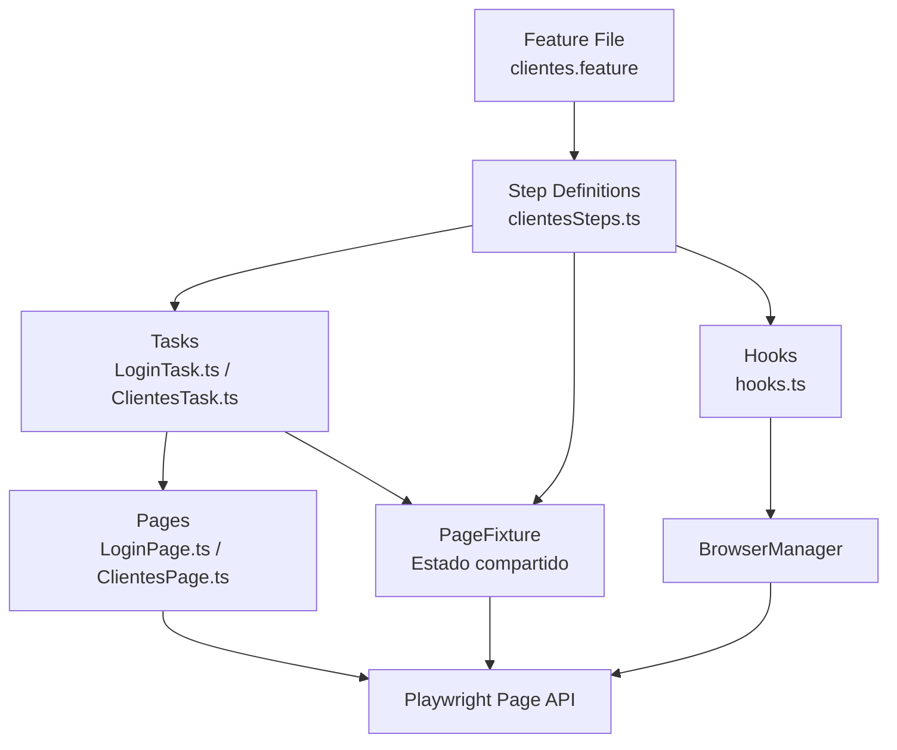

# Documento de Diseño — Automatización E2E Frontend: Login + Creación de Clientes (Terceros)

## Resumen

Este documento describe el diseño técnico para la automatización E2E del flujo de Login y Creación de Clientes (Terceros) en la aplicación Siigo QA Staging. La solución se integra al framework existente de Playwright + Cucumber BDD con TypeScript, siguiendo el patrón Page Object Model (POM) con Tasks como capa de orquestación (patrón Screenplay simplificado).

La automatización cubre:
1. Inicio de sesión en `https://qastaging.siigo.com/#/login`
2. Navegación al formulario de clientes vía botón "+Crear" → "Clientes"
3. Llenado del formulario con datos válidos
4. Verificación de creación exitosa

## Arquitectura

La solución sigue la arquitectura de capas existente en el proyecto:



### Capas de la Arquitectura

| Capa | Responsabilidad | Archivos |
|------|----------------|----------|
| **Feature** | Escenarios BDD en español (Gherkin) | `src/test/features/UI/clientes.feature` |
| **Steps** | Conectan Gherkin con Tasks, assertions | `src/test/steps/ui/clientesSteps.ts` |
| **Tasks** | Orquestan flujos de negocio completos | `src/tasks/ui/LoginTask.ts`, `src/tasks/ui/ClientesTask.ts` |
| **Pages** | Localizadores y acciones atómicas sobre elementos | `src/pages/LoginPage.ts`, `src/pages/ClientesPage.ts` |
| **Fixture** | Estado compartido entre pasos (page, logger, etc.) | `src/hooks/pageFixture.ts` |
| **Hooks** | Ciclo de vida del browser y escenario | `src/hooks/hooks.ts` |

### Decisiones de Diseño

1. **Reutilizar LoginPage existente con localizadores actualizados**: El archivo `src/pages/LoginPage.ts` ya existe con localizadores genéricos. Se actualizarán los localizadores para que correspondan a los elementos reales de la página de login de Siigo (`https://qastaging.siigo.com/#/login`), manteniendo la estructura y convenciones existentes.

2. **Tasks como métodos estáticos**: Siguiendo el patrón establecido en el proyecto (referencia: `GoogleSearchTask`), las Tasks exponen métodos estáticos que reciben `PageFixture` como primer parámetro. Esto permite reutilización sin instanciación.

3. **Feature file en español**: Usando `# language: es` y tags `@layer:Frontend` + `@TEST_TC-xxx` para integración con el sistema de hooks existente y reportes Xray.

4. **Esperas explícitas de Playwright**: Se priorizan `waitFor`, `waitForSelector` y `waitForLoadState` sobre `waitForTimeout` para mayor estabilidad.

## Componentes e Interfaces

### Componente 1: LoginPage (Actualización)

**Archivo**: `src/pages/LoginPage.ts`

**Cambios**: Actualizar los localizadores del objeto `Elements` para que correspondan a los elementos reales de la página de login de Siigo QA Staging. Mantener la estructura existente (Elements readonly, getters, métodos estáticos, métodos de acción, métodos de validación).

**Interfaz pública** (métodos de acción y validación):

```typescript
class LoginPage {
  // Elements actualizados para Siigo
  private readonly Elements = {
    TXT_EMAIL: "selector-real-email",
    TXT_PASSWORD: "selector-real-password",
    BTN_LOGIN: "selector-real-boton-login",
    LBL_ERROR: "selector-real-mensaje-error",
    LBL_DASHBOARD_INDICATOR: "selector-real-indicador-dashboard"
  } as const;

  constructor(page: Page);

  // Getters para Locators
  get emailInput(): Locator;
  get passwordInput(): Locator;
  get loginButton(): Locator;
  get errorLabel(): Locator;
  get dashboardIndicator(): Locator;

  // Acciones
  async fillEmail(email: string): Promise<void>;
  async fillPassword(password: string): Promise<void>;
  async clickLogin(): Promise<void>;
  async login(email: string, password: string): Promise<void>;

  // Validaciones
  async isPageLoaded(): Promise<boolean>;
  async waitForPageLoad(timeout?: number): Promise<void>;
  async isDashboardLoaded(): Promise<boolean>;
  async waitForDashboard(timeout?: number): Promise<void>;
  async isErrorVisible(): Promise<boolean>;
  async getErrorText(): Promise<string>;
}
```

### Componente 2: ClientesPage (Nuevo)

**Archivo**: `src/pages/ClientesPage.ts`

**Responsabilidad**: Encapsular todos los localizadores y acciones atómicas del formulario de creación de clientes.

```typescript
class ClientesPage {
  private readonly Elements = {
    // Navegación al formulario
    BTN_CREAR: "selector-boton-crear",
    BTN_OPCION_CLIENTES: "selector-opcion-clientes",

    // Campos del formulario
    SEL_TIPO_DOCUMENTO: "selector-tipo-documento",
    TXT_NUMERO_DOCUMENTO: "selector-numero-documento",
    TXT_PRIMER_NOMBRE: "selector-primer-nombre",
    TXT_SEGUNDO_NOMBRE: "selector-segundo-nombre",
    TXT_PRIMER_APELLIDO: "selector-primer-apellido",
    TXT_SEGUNDO_APELLIDO: "selector-segundo-apellido",
    TXT_EMAIL: "selector-email-cliente",
    TXT_TELEFONO: "selector-telefono",

    // Acciones del formulario
    BTN_GUARDAR: "selector-boton-guardar",

    // Validaciones
    LBL_NOTIFICACION_EXITO: "selector-notificacion-exito",
    LBL_TITULO_FORMULARIO: "selector-titulo-formulario"
  } as const;

  constructor(page: Page);

  // Getters para Locators
  get crearButton(): Locator;
  get opcionClientesButton(): Locator;
  get tipoDocumentoSelect(): Locator;
  get numeroDocumentoInput(): Locator;
  get primerNombreInput(): Locator;
  get segundoNombreInput(): Locator;
  get primerApellidoInput(): Locator;
  get segundoApellidoInput(): Locator;
  get emailInput(): Locator;
  get telefonoInput(): Locator;
  get guardarButton(): Locator;
  get notificacionExito(): Locator;
  get tituloFormulario(): Locator;

  // Navegación
  async navigateToClientesForm(): Promise<void>;

  // Acciones de llenado
  async selectTipoDocumento(tipo: string): Promise<void>;
  async fillNumeroDocumento(numero: string): Promise<void>;
  async fillPrimerNombre(nombre: string): Promise<void>;
  async fillSegundoNombre(nombre: string): Promise<void>;
  async fillPrimerApellido(apellido: string): Promise<void>;
  async fillSegundoApellido(apellido: string): Promise<void>;
  async fillEmail(email: string): Promise<void>;
  async fillTelefono(telefono: string): Promise<void>;
  async clickGuardar(): Promise<void>;

  // Validaciones
  async isFormLoaded(): Promise<boolean>;
  async waitForFormLoad(timeout?: number): Promise<void>;
  async isCreacionExitosa(): Promise<boolean>;
  async waitForCreacionExitosa(timeout?: number): Promise<void>;
}
```

### Componente 3: LoginTask (Nuevo)

**Archivo**: `src/tasks/ui/LoginTask.ts`

**Responsabilidad**: Orquestar el flujo completo de inicio de sesión.

```typescript
class LoginTask {
  static async performLogin(
    fixture: PageFixture,
    email: string,
    password: string
  ): Promise<void>;

  static async verifyDashboardLoaded(
    fixture: PageFixture
  ): Promise<boolean>;
}
```

**Flujo de `performLogin`**:
1. Navegar a `https://qastaging.siigo.com/#/login`
2. Esperar carga de la página de login (`waitForPageLoad`)
3. Llenar email y contraseña
4. Hacer clic en botón de login
5. Esperar carga del Dashboard (`waitForDashboard`)
6. Registrar cada paso en el logger

### Componente 4: ClientesTask (Nuevo)

**Archivo**: `src/tasks/ui/ClientesTask.ts`

**Responsabilidad**: Orquestar el flujo completo de creación de un cliente.

```typescript
interface ClienteData {
  tipoDocumento: string;
  numeroDocumento: string;
  primerNombre: string;
  segundoNombre?: string;
  primerApellido: string;
  segundoApellido?: string;
  email: string;
  telefono: string;
}

class ClientesTask {
  static async navigateToClientesForm(
    fixture: PageFixture
  ): Promise<void>;

  static async createCliente(
    fixture: PageFixture,
    data: ClienteData
  ): Promise<void>;

  static async verifyCreacionExitosa(
    fixture: PageFixture
  ): Promise<boolean>;
}
```

**Flujo de `createCliente`**:
1. Navegar al formulario de clientes (botón "+Crear" → "Clientes")
2. Esperar carga del formulario
3. Seleccionar tipo de documento
4. Llenar número de documento
5. Llenar nombres y apellidos
6. Llenar email y teléfono
7. Hacer clic en guardar
8. Esperar confirmación de creación exitosa
9. Registrar cada paso en el logger

### Componente 5: Step Definitions (Nuevo)

**Archivo**: `src/test/steps/ui/clientesSteps.ts`

**Responsabilidad**: Conectar los escenarios Gherkin con las Tasks.

```typescript
// Given
Given('que el usuario inicia sesión en Siigo', async function() { ... });

// When
When('el usuario navega al formulario de creación de clientes', async function() { ... });
When('el usuario llena el formulario con datos válidos de cliente', async function() { ... });
When('el usuario guarda el formulario de cliente', async function() { ... });

// Then
Then('el usuario debe ver el Dashboard de Siigo', async function() { ... });
Then('el usuario debe ver el formulario de creación de clientes', async function() { ... });
Then('el usuario debe ver una notificación de creación exitosa', async function() { ... });
```

### Componente 6: Feature File (Nuevo)

**Archivo**: `src/test/features/UI/clientes.feature`

**Estructura**:
```gherkin
# language: es
@layer:Frontend
Característica: Creación de Clientes (Terceros)
  Como QA Engineer
  Quiero automatizar la creación de clientes en Siigo
  Para verificar el flujo E2E de creación de terceros

  Antecedentes:
    Dado que el usuario inicia sesión en Siigo

  @TEST_TC-201
  @smoke
  Escenario: Creación exitosa de un cliente con datos válidos
    Cuando el usuario navega al formulario de creación de clientes
    Y el usuario llena el formulario con datos válidos de cliente
    Y el usuario guarda el formulario de cliente
    Entonces el usuario debe ver una notificación de creación exitosa

  @TEST_TC-202
  Escenario: Navegación al formulario de clientes desde el Dashboard
    Cuando el usuario navega al formulario de creación de clientes
    Entonces el usuario debe ver el formulario de creación de clientes
```

## Modelos de Datos

### ClienteData Interface

```typescript
interface ClienteData {
  tipoDocumento: string;      // Ej: "Cédula de Ciudadanía", "NIT"
  numeroDocumento: string;     // Ej: "1234567890"
  primerNombre: string;        // Ej: "Juan"
  segundoNombre?: string;      // Ej: "Carlos" (opcional)
  primerApellido: string;      // Ej: "Pérez"
  segundoApellido?: string;    // Ej: "García" (opcional)
  email: string;               // Ej: "juan.perez@example.com"
  telefono: string;            // Ej: "3001234567"
}
```

### Datos de prueba por defecto

Los datos de prueba se definen directamente en los Step Definitions para el escenario de creación exitosa:

```typescript
const clienteValido: ClienteData = {
  tipoDocumento: "Cédula de Ciudadanía",
  numeroDocumento: "1098765432",
  primerNombre: "Automation",
  segundoNombre: "Test",
  primerApellido: "QA",
  segundoApellido: "Siigo",
  email: "automation.test@yopmail.com",
  telefono: "3001234567"
};
```

### Credenciales de Login

Las credenciales se obtienen de variables de entorno o se definen como constantes en el Step Definition:

```typescript
const SIIGO_LOGIN_URL = "https://qastaging.siigo.com/#/login";
const SIIGO_EMAIL = "retoautomationsiigo2@yopmail.com";
const SIIGO_PASSWORD = "J1h4{zMTV3";
```

## Manejo de Errores

### Estrategia de Esperas

| Situación | Estrategia | Timeout |
|-----------|-----------|---------|
| Carga de página de login | `waitForSelector` en campo email | 30s |
| Carga del Dashboard post-login | `waitForSelector` en indicador del Dashboard | 30s |
| Apertura del menú "+Crear" | `waitFor` en el botón, luego `click` | 10s |
| Carga del formulario de clientes | `waitForSelector` en título del formulario | 15s |
| Opciones de dropdown disponibles | `waitForSelector` en opciones del select | 10s |
| Notificación de éxito | `waitForSelector` en elemento de notificación | 15s |

### Manejo de Errores por Capa

| Capa | Estrategia |
|------|-----------|
| **Pages** | Métodos de validación retornan `boolean` con `try/catch`. Métodos `waitFor*` lanzan excepción si el timeout se excede. |
| **Tasks** | Registran cada paso en el logger. Si un paso falla, la excepción se propaga con contexto descriptivo. |
| **Steps** | Usan `expect` de Playwright para assertions. Los errores se capturan por el hook `After` que toma screenshot. |
| **Hooks** | El hook `After` captura screenshot en caso de fallo. El hook `Before` configura el browser y logger. |

### Logging

Cada Task registra sus pasos usando `fixture.logger`:
```
[INFO] LoginTask: Navegando a https://qastaging.siigo.com/#/login
[INFO] LoginTask: Página de login cargada
[INFO] LoginTask: Credenciales ingresadas
[INFO] LoginTask: Login enviado
[INFO] LoginTask: Dashboard cargado exitosamente
```

## Estrategia de Testing

### Enfoque

Esta automatización es un proyecto de **testing E2E de UI** que interactúa con una aplicación web externa (Siigo QA Staging). No contiene lógica de negocio propia que se beneficie de property-based testing.

**Property-based testing NO aplica** para este feature porque:
- Las pruebas son interacciones de UI con un sistema externo
- No hay funciones puras con input/output que varíen significativamente
- Los tests son side-effect-heavy (navegación, clicks, formularios)
- El costo de ejecutar 100+ iteraciones contra una app web real es prohibitivo

### Tipos de Tests

| Tipo | Propósito | Herramienta |
|------|----------|-------------|
| **E2E (Cucumber + Playwright)** | Validar flujo completo Login → Crear Cliente | `cucumber-js` con `@playwright/test` |
| **Smoke** | Verificar que la página de login carga correctamente | Tag `@smoke` en feature file |

### Ejecución

```bash
# Ejecutar todos los tests E2E de frontend
npm run test -- --tags "@layer:Frontend"

# Ejecutar solo tests de clientes
npm run test -- --tags "@TEST_TC-201 or @TEST_TC-202"

# Ejecutar solo smoke tests
npm run test -- --tags "@smoke"
```

### Estructura de Archivos Resultante

```
src/
├── pages/
│   ├── LoginPage.ts          ← Actualizado con localizadores reales de Siigo
│   └── ClientesPage.ts       ← Nuevo: Page Object del formulario de clientes
├── tasks/
│   └── ui/
│       ├── LoginTask.ts      ← Nuevo: Task de login
│       └── ClientesTask.ts   ← Nuevo: Task de creación de clientes
├── test/
│   ├── features/
│   │   └── UI/
│   │       └── clientes.feature  ← Nuevo: Feature file BDD en español
│   └── steps/
│       └── ui/
│           └── clientesSteps.ts  ← Nuevo: Step definitions
```
