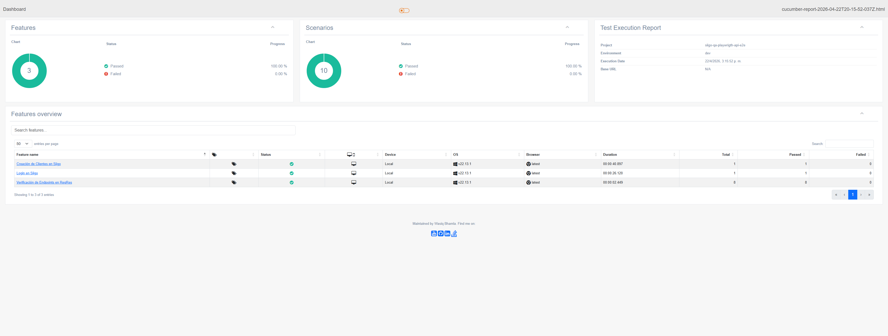
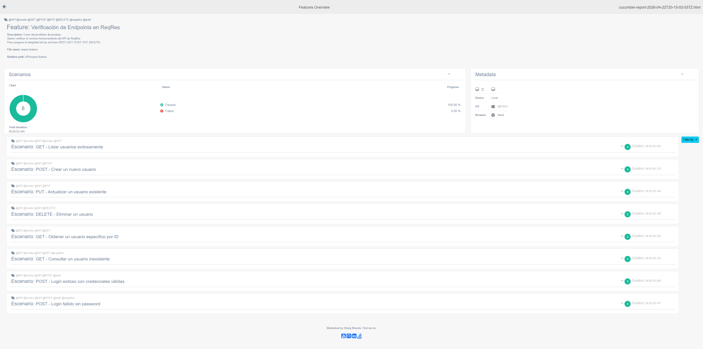

# Prueba Técnica QA Engineer — Siigo

Framework de automatización E2E con **Playwright + Cucumber (BDD)** desarrollado como respuesta a la prueba técnica para QA Engineer.

## Contenido de la prueba

| # | Punto | Ubicación |
|---|-------|-----------|
| 1 | Diseño de casos de prueba (técnicas + Gherkin + Bug report) | [`Test_Case_Design.md`](Test_Case_Design.md) |
| 2 | Automatización Frontend E2E — Login + Crear Cliente | `src/test/features/UI/` |
| 3 | Automatización Backend — Endpoints ReqRes (GET, POST, PUT, DELETE) | `src/test/features/API/` |
| 4 | Evidencias de ejecución | [Ver sección](#-evidencias) |

---

## Tecnologías

- **Playwright** — Automatización de navegador
- **Cucumber** — BDD con Gherkin en español
- **TypeScript** — Tipado estático
- **Patrón Screenplay** — Tasks, Pages, Steps separados
- **multiple-cucumber-html-reporter** — Reportes HTML unificados

---

## Prerequisitos

- Node.js >= 18.x
- NPM >= 9.x

## Instalación

```bash
npm install
```

> `pretest` instala los navegadores de Playwright y prepara los directorios de reportes automáticamente.

## Configuración

El framework soporta múltiples ambientes mediante archivos `.env`:

| Archivo | Ambiente |
|---------|----------|
| `.env.dev` | Desarrollo (default) |
| `.env.stg` | Staging |
| `.env.prod` | Producción |

---

## Ejecución de pruebas

### Comandos principales

```bash
# Ejecutar TODAS las pruebas (UI + API)
npm run test:all

# Solo Login
npm run test:login

# Solo Crear Cliente
npm run test:crear-cliente

# Solo pruebas API (ReqRes)
npm run test --TAGS="@API"

# Cualquier tag específico
npm run test --TAGS="@TEST_TC-200"
```

### Por navegador

```bash
npm run chrome:test
npm run firefox:test
npm run safari:test
npm run parallelCrossBrowser
```

### Pipeline de reportes

El reporte HTML se genera automáticamente al finalizar cada ejecución:

1. **pretest** → Limpia reportes anteriores y crea directorios
2. **test** → Cucumber ejecuta los escenarios y genera JSON
3. **posttest** → Merge de JSONs + generación de HTML

El reporte queda en: `target/site/cypress/index.html`

---

## Estructura del proyecto

```
├── src/
│   ├── helper/
│   │   ├── browser/          # BrowserManager (Chromium, Firefox, WebKit)
│   │   ├── mock/             # Sistema de mocks por test ID
│   │   ├── report/           # Pipeline de reportes (init → merge → HTML)
│   │   ├── util/             # Logger (Winston)
│   │   └── wrapper/          # Wrappers de interacciones y asserts
│   ├── hooks/
│   │   ├── hooks.ts          # Before/After hooks de Cucumber
│   │   └── pageFixture.ts    # Estado compartido entre steps
│   ├── pages/                # Page Objects (LoginPage, ClientPage)
│   ├── tasks/
│   │   ├── api/              # ReqResTask (GET, POST, PUT, DELETE)
│   │   └── ui/               # LoginTask, CreateClientTask
│   └── test/
│       ├── features/
│       │   ├── API/          # reqres.feature
│       │   └── UI/           # login_siigo.feature, crear_cliente.feature
│       └── steps/
│           ├── api/          # reqresSteps.ts
│           └── ui/           # loginSteps.ts, crearClienteSteps.ts
├── docs/                     # Evidencias de ejecución
├── Test_Case_Design.md       # Punto 1: Diseño de casos de prueba
├── cucumber.js               # Configuración de Cucumber
├── tsconfig.json             # Configuración de TypeScript
└── package.json              # Scripts y dependencias
```

---

## Punto 1 — Diseño de casos de prueba

Documentado en [`Test_Case_Design.md`](Test_Case_Design.md), incluye:

- **Partición de equivalencias** — Clases válidas e inválidas por campo
- **Valores límites** — Extremos de rangos para identificación, nombre, dirección
- **Tablas de decisión** — Combinaciones de condiciones y resultados esperados
- **Transición de estados** — Diagrama del flujo del formulario
- **Casos Gherkin** — 2 por nivel (unitario, integración, E2E)
- **Reporte de bug** — BUG-001: Error en cálculo de DV para NITs

---

## Punto 2 — Automatización Frontend E2E

### Escenarios implementados

| Tag | Feature | Descripción |
|-----|---------|-------------|
| `@TEST_TC-300` | `login_siigo.feature` | Login exitoso con credenciales válidas |
| `@TEST_TC-200` | `crear_cliente.feature` | Creación exitosa de un cliente persona |

### Flujo

1. Navega a `https://qastaging.siigo.com/#/login`
2. Ingresa credenciales (usuario/contraseña desde `.env`)
3. Valida que el dashboard cargue
4. Navega a "+Crear" → "Clientes"
5. Llena formulario con datos de prueba
6. Valida mensaje de éxito y redirección al perfil

---

## Punto 3 — Automatización Backend (ReqRes)

### Escenarios implementados

| Verbo | Escenario | Endpoint |
|-------|-----------|----------|
| GET | Listar usuarios paginados | `/api/users?page=2` |
| GET | Obtener usuario por ID | `/api/users/2` |
| GET | Usuario inexistente (404) | `/api/users/999` |
| POST | Crear usuario | `/api/users` |
| PUT | Actualizar usuario | `/api/users/2` |
| DELETE | Eliminar usuario | `/api/users/2` |
| POST | Login exitoso | `/api/login` |
| POST | Login fallido sin password | `/api/login` |

Todos los endpoints apuntan a `https://reqres.in/api` con autenticación via header `x-api-key`.

---

## Evidencias

### Ejecución de pruebas





---

## Reportes

Después de ejecutar las pruebas, el reporte HTML se genera automáticamente en:

```
target/site/cypress/index.html
```

Para generar reportes manualmente:

```bash
npm run mergeReports
npm run generate:merged:html
```

---

## Autor

Prueba técnica desarrollada para el proceso de selección de QA Engineer en Siigo.
