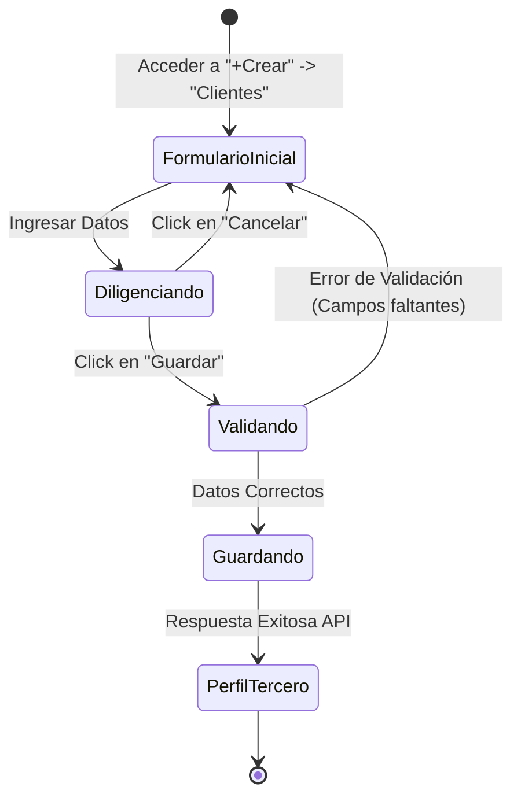

# Diseño de Casos de Prueba - Funcionalidad de Clientes (Siigo)

Este documento detalla la aplicación de técnicas de diseño de pruebas para el formulario de creación de terceros en Siigo.

## 1. Técnicas de Diseño de Pruebas

### 1.1 Partición de Equivalencias
Dividimos los datos de entrada en grupos que se espera que se comporten de la misma manera.

| Campo | Partición Válida | Partición Inválida |
| :--- | :--- | :--- |
| **Tipo de Identificación** | Cédula, NIT, Pasaporte (Existentes en lista) | Valor nulo, Valor no existente |
| **Número de Identificación** | Numérico (8-10 dígitos para Cédula) | Alfanumérico, Símbolos, Vacío |
| **Nombres / Apellidos** | Texto alfabético, espacios | Caracteres especiales, Solo números |
| **Correo Electrónico** | formato@dominio.com | sin_arroba.com, @sin_usuario.com |
| **Ciudad** | Selección de lista desplegable | Texto libre que no coincide con la lista |

### 1.2 Valores Límites
Enfoque en los extremos de los rangos permitidos.

| Campo | Límite Inferior (LI) | Límite Superior (LS) |
| :--- | :--- | :--- |
| **Identificación (Cédula)** | 5 dígitos (Mínimo legal esperado) | 12 dígitos (Máximo legal esperado) |
| **Nombre** | 2 caracteres | 100 caracteres |
| **Dirección** | 5 caracteres | 200 caracteres |
| **Código Postal** | 6 dígitos (Exacto) | N/A |

### 1.3 Tablas de Decisión
Analizamos combinaciones de condiciones para determinar el resultado esperado.

| Condición | Regla 1 | Regla 2 | Regla 3 | Regla 4 |
| :--- | :---: | :---: | :---: | :---: |
| **Tipo de Tercero** | Persona | Empresa | Persona | Empresa |
| **Identificación Válida** | Sí | Sí | No | No |
| **Campos Obligatorios Llenos** | Sí | No | Sí | No |
| **Resultado Esperado** | **Éxito** | **Error (Requeridos)** | **Error (ID)** | **Error (Varios)** |

### 1.4 Transición de Estados
Flujo del formulario de creación.



---

## 2. Casos de Prueba (Gherkin)

### 2.1 Nivel Unitario (Validación de Lógica)
**Escenario 1: Validación de formato de correo electrónico**
```gherkin
Scenario: El sistema debe rechazar correos electrónicos con formato inválido
  Given el componente de validación de correo está activo
  When ingreso el correo "usuario_sin_dominio"
  Then el resultado de la validación debe ser "Falso"
```

**Escenario 2: Cálculo del Dígito de Verificación (DV)**
```gherkin
Scenario: El sistema calcula correctamente el DV para un NIT
  Given el algoritmo de cálculo de DV de la DIAN
  When ingreso el NIT "900123456"
  Then el dígito calculado debe ser "7"
```

### 2.2 Nivel Integración (UI vs API)
**Escenario 1: Sincronización de lista de ciudades**
```gherkin
Scenario: Obtener ciudades desde el servicio externo
  Given que el formulario de creación está cargado
  When el usuario escribe "Bog" en el campo Ciudad
  Then se debe realizar una petición GET al endpoint de ciudades
  And la UI debe mostrar una lista con "Bogotá (D.C.)"
```

**Escenario 2: Manejo de error 409 (Tercero Duplicado)**
```gherkin
Scenario: El sistema maneja duplicidad de identificación desde el backend
  Given que ingreso una identificación ya registrada "1020304050"
  When intento guardar el tercero
  Then el API responde con código 409 Conflict
  And la UI muestra el mensaje "El tercero ya se encuentra registrado"
```

### 2.3 Nivel E2E (Flujo Completo)
**Escenario 1: Creación exitosa de un Cliente Persona**
```gherkin
Scenario: Crear un nuevo cliente tipo persona satisfactoriamente
  Given que el usuario está logueado en Siigo
  And navega a la sección de creación de Clientes
  When completa los campos obligatorios para una Persona
  And hace clic en el botón Guardar
  Then el sistema muestra el mensaje de éxito "Tercero guardado exitosamente"
  And redirige a la vista de perfil del nuevo tercero
```

**Escenario 2: Cancelación de creación de cliente**
```gherkin
Scenario: El usuario decide no guardar los cambios
  Given que el usuario ha ingresado datos parciales en el formulario
  When hace clic en el botón Cancelar
  Then el sistema debe regresar a la pantalla anterior sin guardar cambios
  And los datos ingresados no deben persistir en la base de datos
```

---

## 3. Reporte de Bug

**ID:** BUG-001
**Título:** Error en el cálculo automático del Dígito de Verificación (DV) para NITs de 10 dígitos.
**Severidad:** Media
**Prioridad:** Alta

**Descripción:**
Al ingresar un NIT de 10 dígitos en el campo de identificación, el campo "Dv" se autocompleta con un valor erróneo o permanece vacío, lo que impide el guardado correcto del tercero según las reglas de negocio de la DIAN.

**Pasos para reproducir:**
1. Iniciar sesión en Siigo.
2. Ir a "+Crear" -> "Clientes".
3. Seleccionar Tipo: "Empresa" y Tipo de Identificación: "NIT".
4. Ingresar el número "9001234567" en Identificación.
5. Click en Dv y observar el campo "Dv".

**Resultado Esperado:**
El campo "Dv" debe calcularse automáticamente como "5" (ejemplo basado en algoritmo DIAN).

**Resultado Actual:**
El campo "Dv" muestra "0".

**Evidencia:** (Ver captura adjunta en el reporte original)
